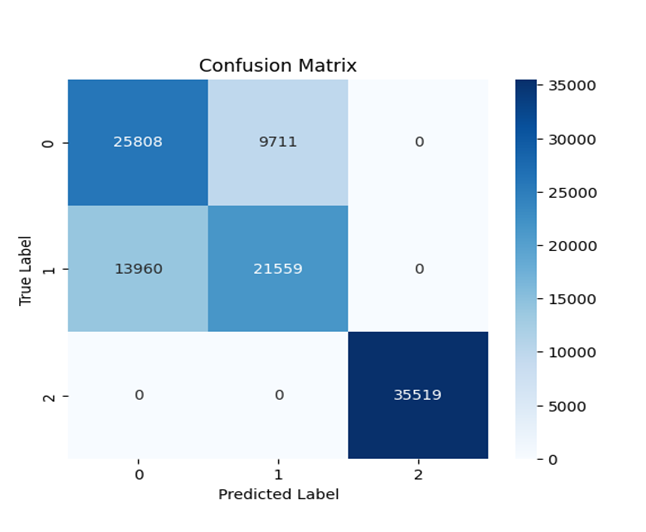
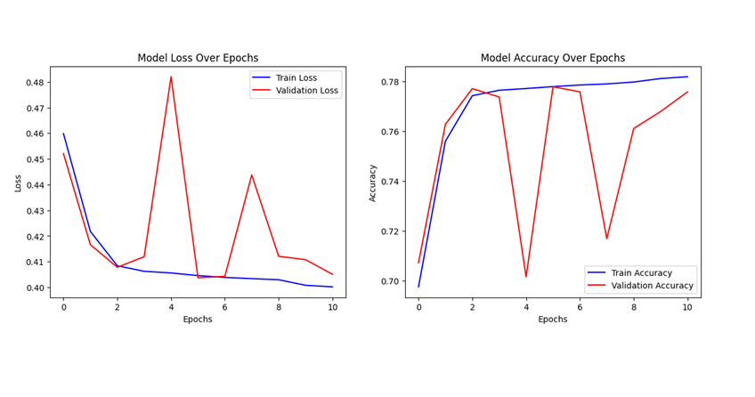
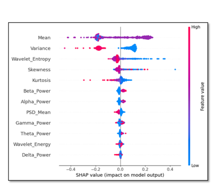
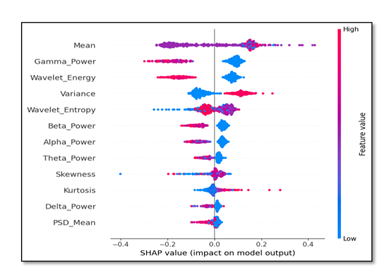
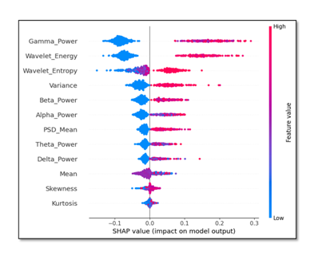

# EEG Classification with Multi-Scale CNN & SHAP

## Data & Quick Test (works locally or in Colab)

We do **not** redistribute PhysioNet data.
⚠️ Due to the dataset size and CNN training requirements, meaningful results require the full PhysioNet dataset. Running on a very small subset will only verify code execution, not produce valid accuracy numbers.

## 📌 Overview
This project classifies EEG signals using a **Multi-Scale Convolutional Neural Network (MSCNN)** and explains predictions with **SHAP** for transparency in healthcare use cases.

- Problem: Movement intention/EEG pattern classification with clinically useful explanations  
- Approach: Clean & segment EEG → extract multi-domain features → train MSCNN → interpret with SHAP  
- Result: **77.92% accuracy** on ~9,258 augmented epochs; MSCNN outperformed SVM/RF baselines by **6–10%**

## 🧠 Dataset
- Source: **PhysioNet EEG** (109 subjects; Sharbrough/64-channel montage)  
- After preprocessing & augmentation: **~9,258 epochs**  
- NOTE: Access dataset directly from PhysioNet (follow their license/terms)

## ⚙️ Pipeline
1. **Preprocessing:**  
   Bandpass (0.5–40 Hz), 50 Hz notch, **ICA** for artifacts, re-referencing, epoching  
2. **Feature extraction (multi-domain):**  
   - **Time:** mean, variance, skewness, kurtosis, Hjorth  
   - **Frequency:** PSD/FFT features, band powers (delta→gamma)  
   - **Wavelet:** DWT energies/statistics  
3. **Models:**  
   - Baselines: **SVM**, **Random Forest**  
   - Main: **Multi-Scale CNN** (parallel conv blocks with different kernel sizes; GAP + dense head)  
4. **Explainability:**  
   - **SHAP** to understand feature contributions per prediction (global + local)

## 📈 Results
- MSCNN test accuracy: **77.92%**  
- Visuals (see `/results`): confusion matrix, training curve, SHAP summary

## 🛠 Tech Stack
**Python**, **MNE**, **NumPy/Pandas**, **Scikit-learn**, **TensorFlow/Keras**, **SHAP**, **Matplotlib**


## 📂 Project Structure
```text
EEG-MultiScale-CNN-SHAP/
├─ notebooks/
│  └─ EEG_SHAP.ipynb
├─ results/
│  ├─ confusion_matrix.png
│  ├─ training_curves.png
│  ├─ shap_class0.png
│  ├─ shap_class1.png
│  └─ shap_class2.png
├─ requirements.txt
└─ README.md
```


## ▶️ Quick Start


```bash
1) Create a virtual env and install deps:
python -m venv .venv && source .venv/bin/activate  # Windows: .venv\Scripts\activate
pip install -r requirements.txt 

2) Open the notebooks in /notebooks in order (01 → 03).

3) Place your raw data where the notebook expects it (update paths in the first cell).

4) Export plots to /results from the notebooks.

🖼 Key Figures
• results/confusion_matrix.png — test performance overview

• results/training_curves.png — training/validation accuracy vs epochs

• results/shap_class0.png — global feature importance (SHAP)

• results/shap_class1.png — global feature importance (SHAP)

• results/shap_class2.png — global feature importance (SHAP)


✅ Notes
• No subject leakage (per-subject splits)

• Reproducible seeds set for training & feature extraction

• Clear separation of Check → Apply → Visualize steps per preprocessing block

📢 Status
• Core pipeline complete (full dataset run with per-subject splits and reproducible seeds).
• Cross-validation implemented in code.
• Per-class metrics (precision, recall, F1) not computed due to compute constraints — can be added in future work.

📜 License
This repo is for academic/educational use. Follow PhysioNet terms for original data.

---


Create a file named **requirements.txt** with this minimal set:
numpy
pandas
scikit-learn
mne
matplotlib
tensorflow
shap
pywavelets


Commit & push:
```bash
git add requirements.txt README.md
git commit -m "docs: add full README and requirements"
git push

## 🔎 Quick Preview

<p align="center">
  
  
</p>

<p align="center">
 
 
 

</p>


